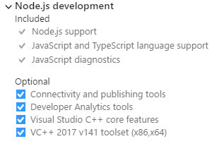
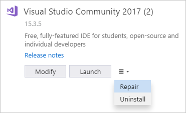

# Node.js requirements

To install support for developing Node.js application in Visual Studio 2017, follow the instructions for selecting the Node.js workload in the Visual Studio 2017 installer, and downloading and installing the 
Node.js runtime.

To quickly test the Node.js support after following the installation steps, open the Node.js Interactive 
Window by pressing Alt-K,N and entering `2+2`. If you don't see the output of `4`, recheck your steps.
For details, see [Using the Interactive Window](interactivewindow.md).

> [!Note]
> Node.js support is not presently available in Visual Studio for Mac, but is available on Mac and Linux
through Visual Studio Code.

## Installing Visual Studio 2017

1. Download and run the latest Visual Studio 2017 installer:

    > [!div class="nextstepaction"]
    > [Install Visual Studio 2017 Community]
    (https://www.visualstudio.com/thank-you-downloading-visual-studio/?sku=Community&rel=15&utm_source=docs&utm_medium=clickbutton)

    >[!Tip]
    > The Community edition is for individual developers, classroom learning, academic research, and open source development. For other uses, install [Visual Studio 2017 Professional](https://www.visualstudio.com/thank-you-downloading-visual-studio/?sku=Professional&rel=15&utm_source=docs&utm_medium=clickbutton) 
    or [Visual Studio 2017 Enterprise](https://www.visualstudio.com/thank-you-downloading-visual-studio/?sku=Enterprise&rel=15&utm_source=docs&utm_medium=clickbutton).

1. The installer presents you with a list of workloads, which are groups of related options for specific development areas. For Node.js, select the **Node.js** workload.

    

1. On the right side of the installer, chose additional options if desired. Skip this step to accept the default options.

    

    | Option | Description | 
    | --- | --- |
    | Connectivity and publishing tools | Publishing to Azure ?? |
    | Developer Analytics tools | No idea ?? |
    | Visual Studio C++ core features | Installs tools C++ development, these are necessary for creating native modules. |
    | VC++ 2017 v141 toolset (x86,x64) | Installs the default C++ compiler, this is necessary for consuming native modules. |

1. After installation, the installer provides options to modify, launch, repair, or uninstall Visual Studio. The **Modify** button changes to **Update** when updates to Visual Studio when updates are available for any installed components. (The modify option is then available on the drop-down menu.) You can also launch Visual Studio and the installer from the Windows Start menu by searching on "Visual Studio".

    

## Installing the Node.js runtime

Node.js support doesn't come with a Node.js Runtime, so you need to install a version from the 
[Node.js website](https://nodejs.org/en/download/). In general, Visual Studio automatically detects the 
installed Node.js runtime, if it does not detect an installed runtime you can configure your project
to reference the installed runtime.

>[!Tip]
>Although Visual Studio 2017 does support older versions, we recommend you install at least the 
current LTS Version.  