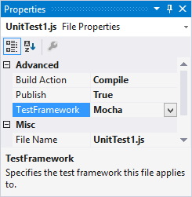

# Unit testing in Node.js

The Node.js Tools For Visual Studio allows you to write and run unit tests using some of the more popular
frameworks without the need to switch to a command prompt.

The supported frameworks are:

* Mocha ([mochajs.org](http://mochajs.org/))
* Jasmine ([Jasmine.github.io](https://jasmine.github.io/))
* Tape ([github.com/substack/tape](https://github.com/substack/tape))
* Export Runner (a Node.js tools specific framework)

> [!Warning]
> There is currently an issue in Tape which prevents tests from running.
> If [this PR](https://github.com/substack/tape/pull/361) is merged that should be resolved.

> [!Tip]
> If your favorite framework is not supported see [adding support for a unit test framework](#addingFramework)
> on how to add support.

## Writing unit tests

Before adding unit tests to your project, make sure the framework you plan on using is installed **locally** in
your project. This is easiest using the [npm install window](npm.md#npmInstallWindow).

The preferred way to add unit tests to your project is by creating a `tests` folder in
your project, and setting that as the test root in project properties. You also need
to select the test framework you want to use.


Alternatively you can add simple blank tests to your project, using the Add New Item dialog, both JavaScript and TypeScript are supported in the same project.


And set the Test Framework property on the file to the required test framework.



After opening the Test Explorer (from the Test, Windows, Test Explorer menu), the tests will be discovered and
displayed. If they're not showing initially rebuild the project to refresh the list.


> [!Note]
> If you use the `outdir` or `outfile` option in `tsconfig.json`, the Text Explorer won't be able to find your
> unit tests in TypeScript files.

## Running tests

Tests can be run in Visual Studio 2017, or from the command line.

### Running tests in Visual Studio 2017

You can run the tests by clicking the 'Run All' link in the Test Explorer window, or by selecting one or more
tests or groups, right-clicking and selecting 'Run Selected Tests'. Tests will be run in the background, and the
display will update and show the results. Furhter you can also debug selected tests by selecting
'Debug Selected Tests'.

> [!Note]
> Currently we don't support profiling tests, or code coverage.

### Running tests from the command line

You can run the tests from the 'Developer Command for VS 2017" using the following:

```
vstest.console.exe <path to project file>\NodejsConsoleApp23.njsproj /TestAdapterPath:<VisualStudioFolder>\Common7\IDE\Extensions\Microsoft\NodeJsTools\TestAdapter
```

This should show output similar to:

```
Microsoft (R) Test Execution Command Line Tool Version 15.5.0
Copyright (c) Microsoft Corporation.  All rights reserved.

Starting test execution, please wait...
Processing: NodejsConsoleApp23\NodejsConsoleApp23\UnitTest1.js
  Creating TestCase:NodejsConsoleApp23\NodejsConsoleApp23\UnitTest1.js::Test Suite 1 Test 1::mocha
  Creating TestCase:NodejsConsoleApp23\NodejsConsoleApp23\UnitTest1.js::Test Suite 1 Test 2::mocha
Processing finished for framework of Mocha
Passed   Test Suite 1 Test 1
Standard Output Messages:
 Using default Mocha settings
 1..2
 ok 1 Test Suite 1 Test 1

Failed   Test Suite 1 Test 2
Standard Output Messages:
 not ok 1 Test Suite 1 Test 2
   AssertionError [ERR_ASSERTION]: This should fail
       at Context.<anonymous> (NodejsConsoleApp23\NodejsConsoleApp23\UnitTest1.js:10:16)

Total tests: 2. Passed: 1. Failed: 1. Skipped: 0.
Test Run Failed.
Test execution time: 1.5731 Seconds
```

> [!Note]
> If you get an error that `vstest.console.exe` can not be found make sure you've openend the Developer Command
> Prompt and not a regular command prompt.

## <a name="addingFramework"></a>Adding support for a unit test framework

You can extend the support for additional test frameworks by implementing the discovery and execution logic
using JavaScript.
In the following location:
<VisualStudioFolder>\Common7\IDE\Extensions\Microsoft\NodeJsTools\TestAdapter\TestFrameworks
You'll see folders for the various supported test frameworks.
Under each folder, a JavaScript file named after the folder contains 2 exported functions:

* `find_tests`
* `run_tests`

See the implementation of Mocha for examples of `find_tests` and `run_tests` implementations.

> [!Note]
> The name of the folder must match the name of the .js file. Discovery of test frameworks happens at VS start.
> If a framework is added while VS is running, VS must be restarted for detection to occur.

> [!Note]
> Be sure to set the TestFramework property on your test file(s) to match the name of the subfolder under
> TestFrameworks.